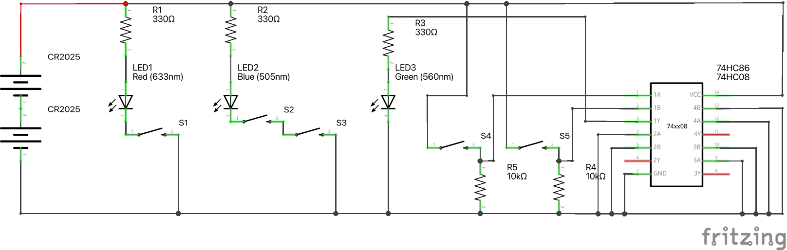
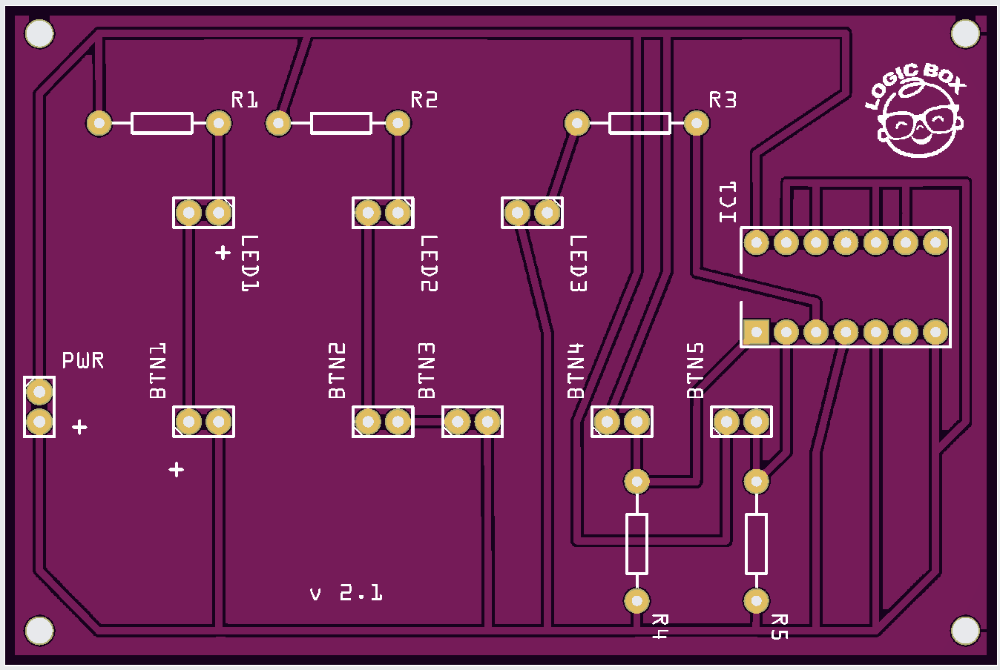
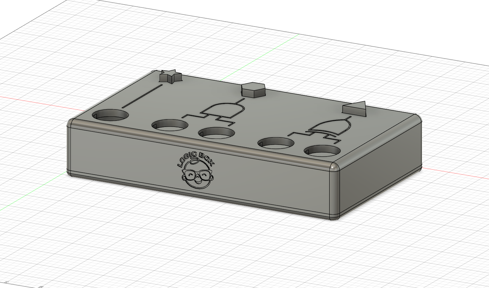

# Logic Box v2.1

Para más detalle sobre le proyecto puedes visitar el siguiente [sitio](https://ezesoler.com/logicbox)

## Listado de componentes

| Nombre | Cantidad |  Componente  |
|--|--|--|
| LED1 | 1 | Led Rojo de 10mm |
| LED2 | 1 | Led Azul de 10mm |
| LED3 | 1 | Led Verde de 10mm |
| R1, R2, R3 | 3  | Resistencia 330 Ω |
| S1, S2, S3, S4, S5 | 5  | Boton pulsador arcade de 30mm |
| R4, R5 | 2  | Resistencia 10 kΩ |
| 74HC86 | 1  | Compuerta lógica cuádruple |
| CR2025 | 2  | Batería CR2025 de 3V |

Simulación montaje en protoboard en [Tinkercad](https://www.tinkercad.com/things/bEHhhJZuyzz?sharecode=dyOD2t0xn3G-a6pu4hyFaRKaPOuoOR1O2RBs0LghjeE) 

## PCB

[Editable](Logic_Box_Schematic.fzz "download")  
[Gerber](gerber/PCB_LB_v2.1.zip "download")

## Modelo 3D para impresión

[Editable \(Fusion 360\)](3D%20Print/Logic%20Box%202.1.f3d "download")  
[Archivos STL para impresión](3D%20Print/stl)